## 수업내용
DynamoDB(NoSQL)와 RDBMS(Relational Database Management System)는 데이터 저장 방식, 확장성, 유연성, 일관성 모델 등에서 중요한 차이가 있습니다. 

## 차이점
| 항목          | DynamoDB (NoSQL)                           | RDBMS (예: MySQL, PostgreSQL)           |
| ----------- | ------------------------------------------ | -------------------------------------- |
| **데이터 모델**  | Key-Value / Document 기반                    | 테이블, 행(Row), 열(Column)                 |
| **스키마**     | **스키마 없음 (유연)**<br>각 아이템이 다른 속성 가질 수 있음    | **엄격한 스키마**<br>모든 행은 같은 구조             |
| **확장성**     | **수평 확장 (Scale-out)**<br>노드 추가로 처리량 증가     | **수직 확장 (Scale-up)**<br>CPU, RAM 업그레이드 |
| **트랜잭션**    | 제한적 트랜잭션 지원<br>ACID 일부 보장 (2020 이후 점점 강화됨) | 강력한 ACID 트랜잭션 지원                       |
| **쿼리 언어**   | 쿼리 제한적 (PK, SK 위주), 필터 지원<br>SQL 아님        | SQL 사용 가능, 복잡한 조인/조건 가능                |
| **인덱싱**     | 기본 키(PK, SK), GSI, LSI 사용                  | PK, FK, 다중 인덱스 자유롭게 생성 가능              |
| **관계(조인)**  | **조인 불가**, 앱 레벨에서 처리해야 함                   | **조인 가능** (INNER, OUTER 등)             |
| **속도 및 성능** | 대량 트래픽에 강함, 밀리초 단위 응답                      | 정규화된 복잡 쿼리에 강함                         |
| **운영/관리**   | 완전 관리형 (AWS가 운영)                           | DB 관리 필요 (백업, 튜닝 등)                    |


## 🔧 Features
- Add new employees to AWS DynamoDB
- View employee details by ID
- Delete employee records
- List all employees stored in the cloud

---

## 🧰 Tech Stack

- Java (JDK 8+)
- AWS DynamoDB (NoSQL)
- AWS SDK for Java v2
- Maven (for dependency management)

---

## 🚀 Setup Instructions

1. **Install Java and Maven**
2. **Set up AWS CLI** and configure credentials:
   ```bash
   aws configure


## maven clean , package 등의 작업 후
## MainApp.java Run
## Error:
? An error occurred: User: arn:aws:iam::086015456585:user/DevUser0002 is not authorized to perform: dynamodb:GetItem on resource: arn:aws:dynamodb:AP_NORTHEAST_2:086015456585:table/Employees because no identity-based policy allows the dynamodb:GetItem action (Service: DynamoDb, Status Code: 400, Request ID: UFTID00VACDLSHMR64KDB87APFVV4KQNSO5AEMVJF66Q9ASUAAJG) 

## Dynamo DB 설치
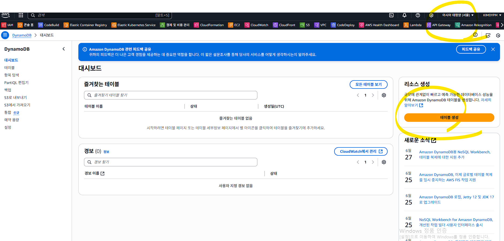

## 테이블 생성 - 소스의 내용에 부합하도록
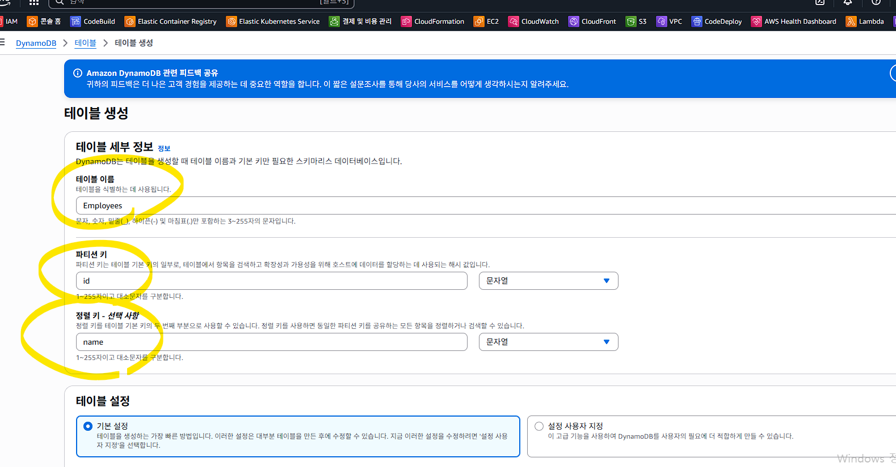


## 약간의 시간 소요 후 생성확인
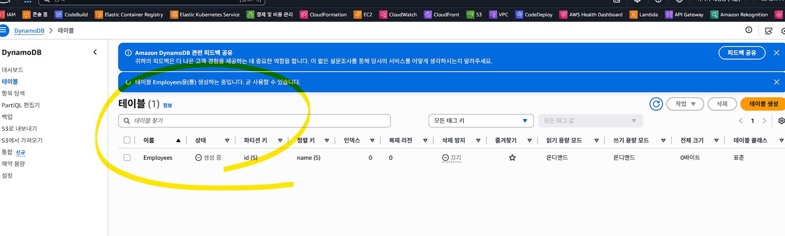

## Error - dynamodb:GetItem on resource: arn:aws:dynamodb:AP_NORTHEAST_2:086015456585:table/Employees 부분 해결
## 권한 탭 클릭
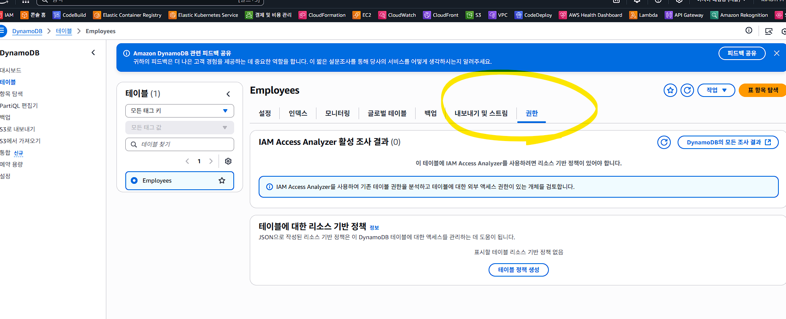

## 테이블 정책 생성 클릭
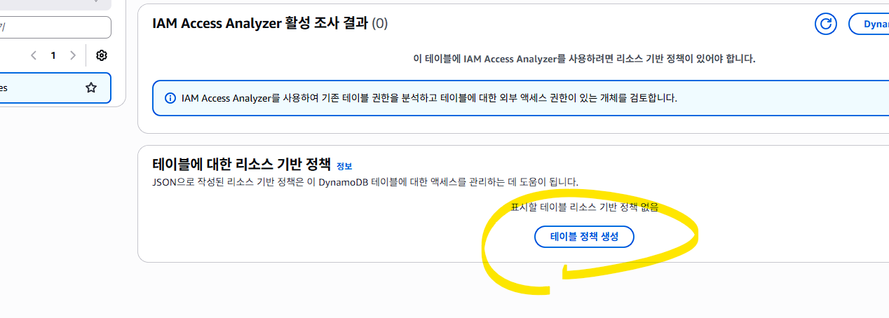

## 정책예제 클릭
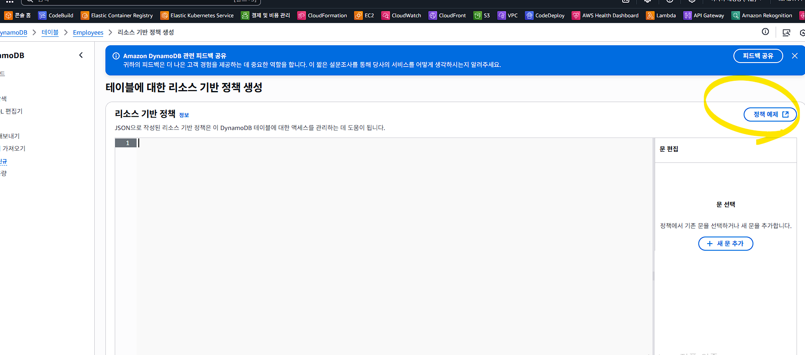
https://docs.aws.amazon.com/amazondynamodb/latest/developerguide/rbac-examples.html

의 중간에 json 유형 복사

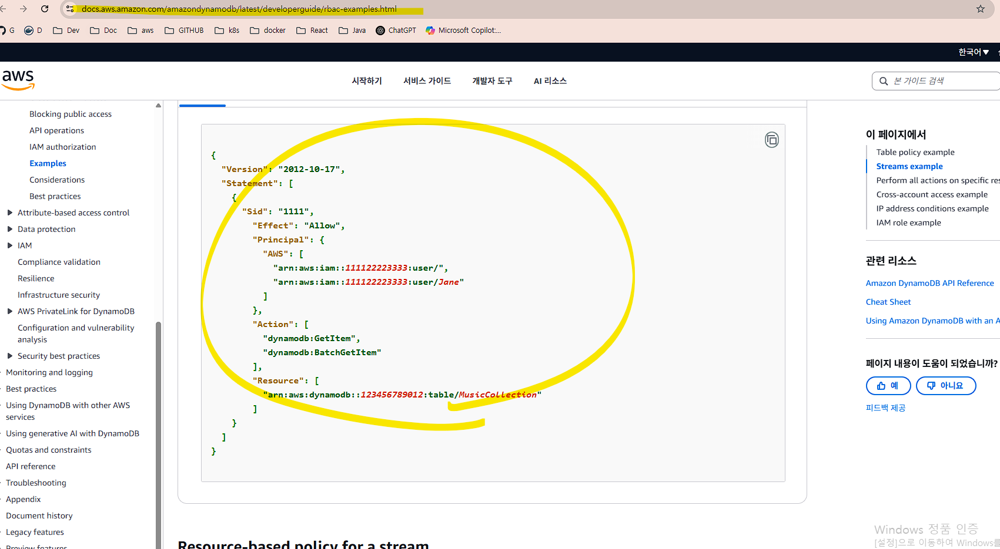

## 복붙 후 수정
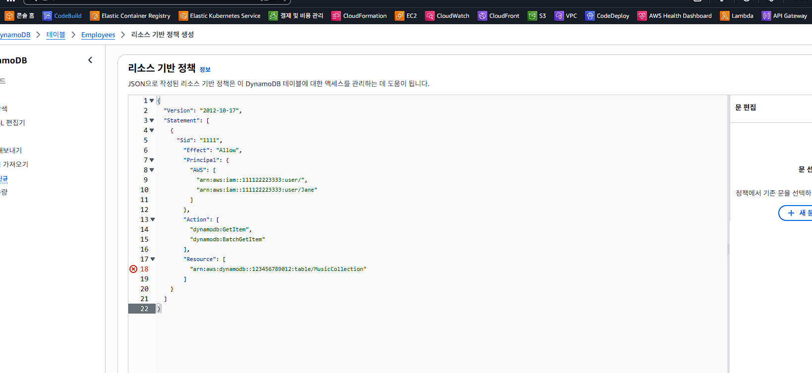
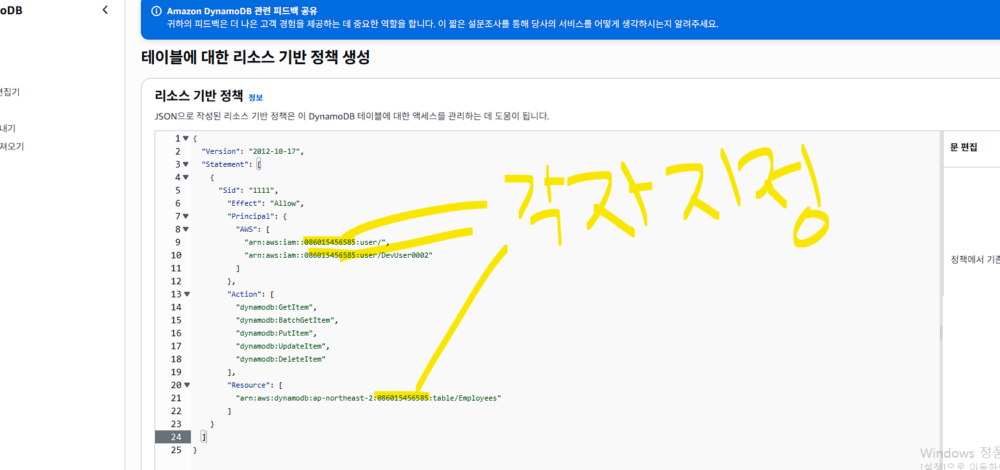

## 오류 없음 확인 및 Action 의 CRUD 부분 체크
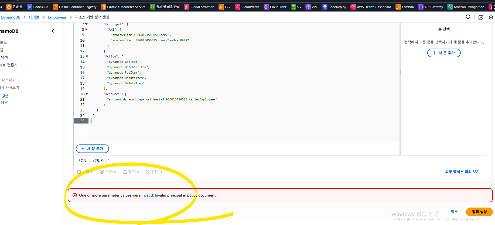

## DynamoDB 테이블에 직접 붙이는 Resource Policy는 지원되지 않음
## IAM User 에 직접 붙여야함.

## IAM 으로 이동
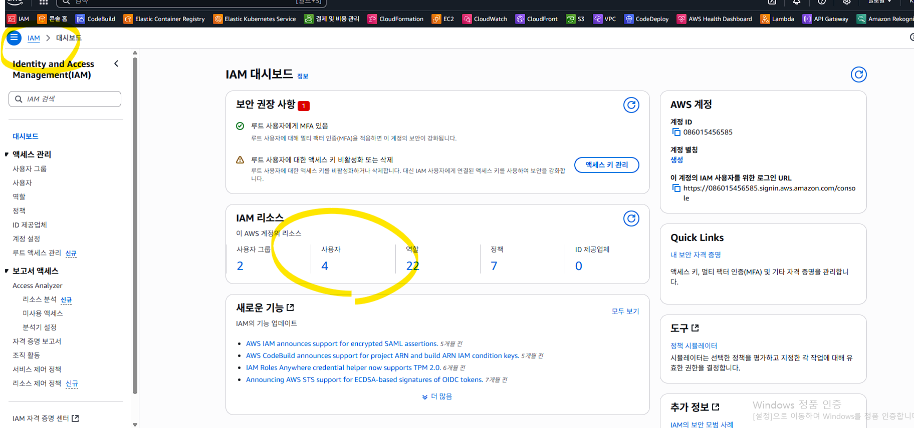

## 팀 - 권한 선택
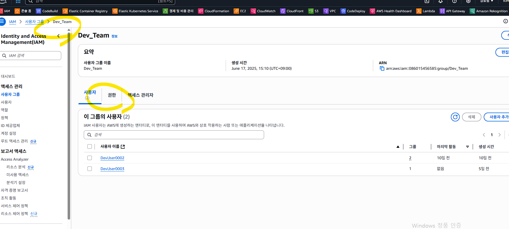

## 권한 - 인라인정책
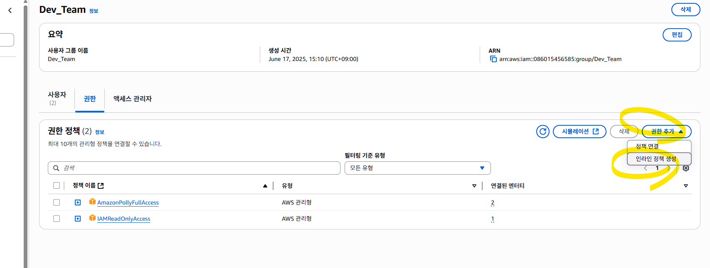

## json 형태
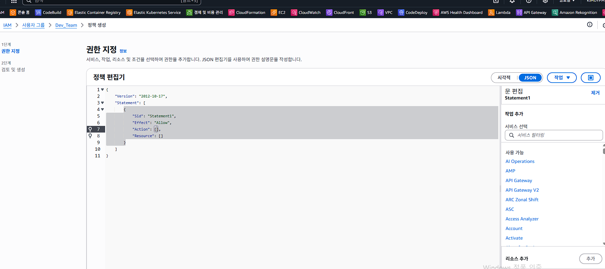

## json 내용
{
  "Version": "2012-10-17",
  "Statement": [
    {
      "Sid": "AllowCrudForEmployeesTable",
      "Effect": "Allow",
      "Action": [
        "dynamodb:GetItem",
        "dynamodb:BatchGetItem",
        "dynamodb:PutItem",
        "dynamodb:UpdateItem",
        "dynamodb:DeleteItem"
      ],
      "Resource": "arn:aws:dynamodb:ap-northeast-2:086015456585:table/Employees"
    }
  ]
}


## 입력
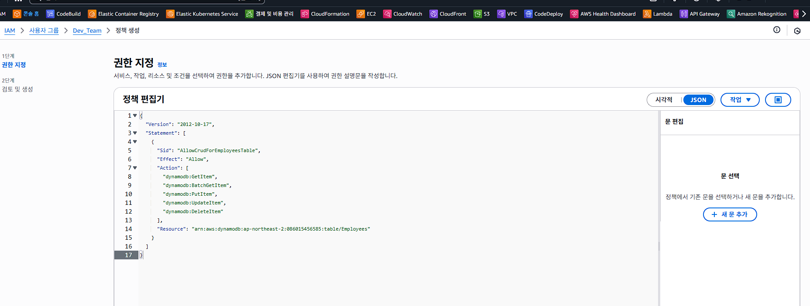

## 생성
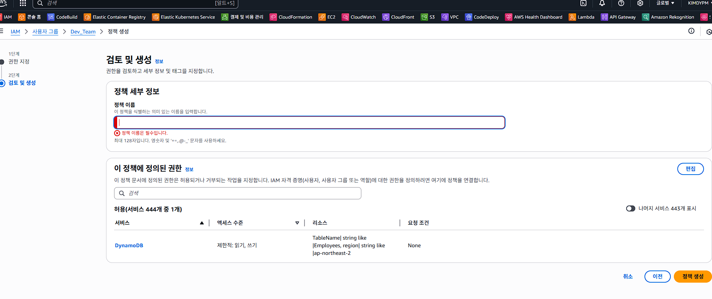
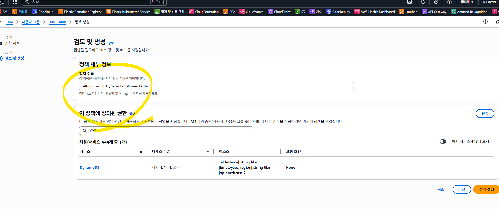

## 생성 후 확인
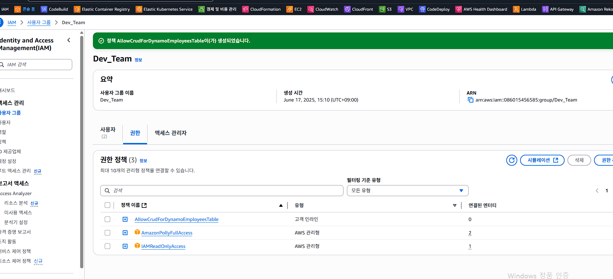

## 모듈 재실행
1~5 까지 실행할 모듈을 선택하세요: 1
ID: 11111
Name: david 
Age: 30
Position: IT
Salary: 2000
? An error occurred: One or more parameter values were invalid: Type mismatch for key id expected: S actual: N (Service: DynamoDb, Status Code: 400, Request ID: IV368NONK9H6N8N5FDREVC7TLVVV4KQNSO5AEMVJF66Q9ASUAAJG)

## DynamoDB 테이블의 파티션 키(id)의 타입이 문자열(String, S)인데,
## Java 코드에서 숫자(Number, N)로 넣고 있어서 생기는 오류

## 현재 소스 보면
public class Employee {
    private int id;
    private String name;
    private int age;
    private String position;
    private double salary;

    public Employee(int id, String name, int age, String position, double salary) {
        this.id = id;
        this.name = name;
        this.age = age;
        this.position = position;
        this.salary = salary;

## 위에서 private int id; 부분 String 으로 수정
## 관련 소스 부분 도 수정
                    case 1 -> {
                        System.out.print("ID: ");
                        String id = sc.nextLine();

## 수업 내용에서는 이미 수정 소스로 배포
## AWS CLI 로 체크
aws dynamodb describe-table --table-name Employees

## Error
An error occurred (AccessDeniedException) when calling the DescribeTable operation: User: arn:aws:iam::086015456585:user/DevUser0002 is not authorized to perform: dynamodb:DescribeTable on resource: arn:aws:dynamodb:ap-northeast-2:086015456585:table/Employees because no identity-based policy allows the dynamodb:DescribeTable action

## Action 의 권한 부족으로 다음과 같이 추가
"Action": [
        "dynamodb:DescribeTable",
        "dynamodb:GetItem",
        "dynamodb:BatchGetItem",
        "dynamodb:PutItem",
        "dynamodb:UpdateItem",
        "dynamodb:DeleteItem",
        "dynamodb:Scan",
        "dynamodb:Query"
      ],

## 부여한 정책에 추가 및 수정
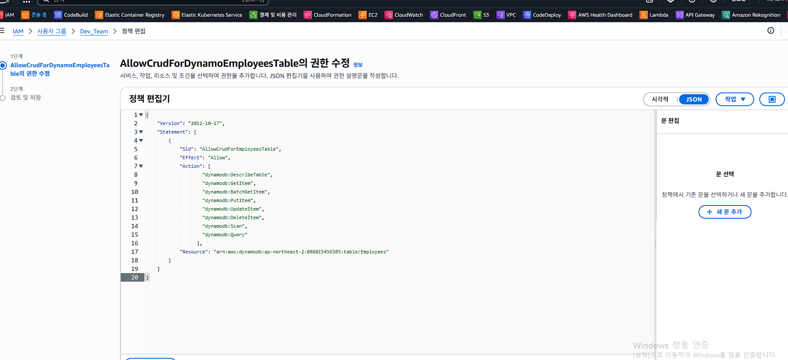

## IAM 작업후 반영 시간 소요 필요 1~2분 정도 대기
## aws dynamodb describe-table --table-name Employees 재실행
## 기본 정보
{
    "Table": {
        "AttributeDefinitions": [
            {
                "AttributeName": "id",
                "AttributeType": "S"
    "Table": {
        "AttributeDefinitions": [
            {
                "AttributeName": "id",
                "AttributeType": "S"
        "AttributeDefinitions": [
            {
                "AttributeName": "id",
                "AttributeType": "S"
            {
                "AttributeName": "id",
                "AttributeType": "S"
                "AttributeName": "id",
                "AttributeType": "S"
            },
                "AttributeType": "S"
            },
            {
                "AttributeName": "name",
            },
            {
                "AttributeName": "name",
                "AttributeType": "S"
            }
            {
                "AttributeName": "name",
                "AttributeType": "S"
            }
                "AttributeName": "name",
                "AttributeType": "S"
            }
        ],
                "AttributeType": "S"
            }
        ],
        "TableName": "Employees",
        "KeySchema": [
        ],
        "TableName": "Employees",
        "KeySchema": [
        "TableName": "Employees",
        "KeySchema": [
            {
        "KeySchema": [
            {
            {
                "AttributeName": "id",
                "AttributeName": "id",
                "KeyType": "HASH"
            },
            {
                "AttributeName": "name",
                "KeyType": "RANGE"


